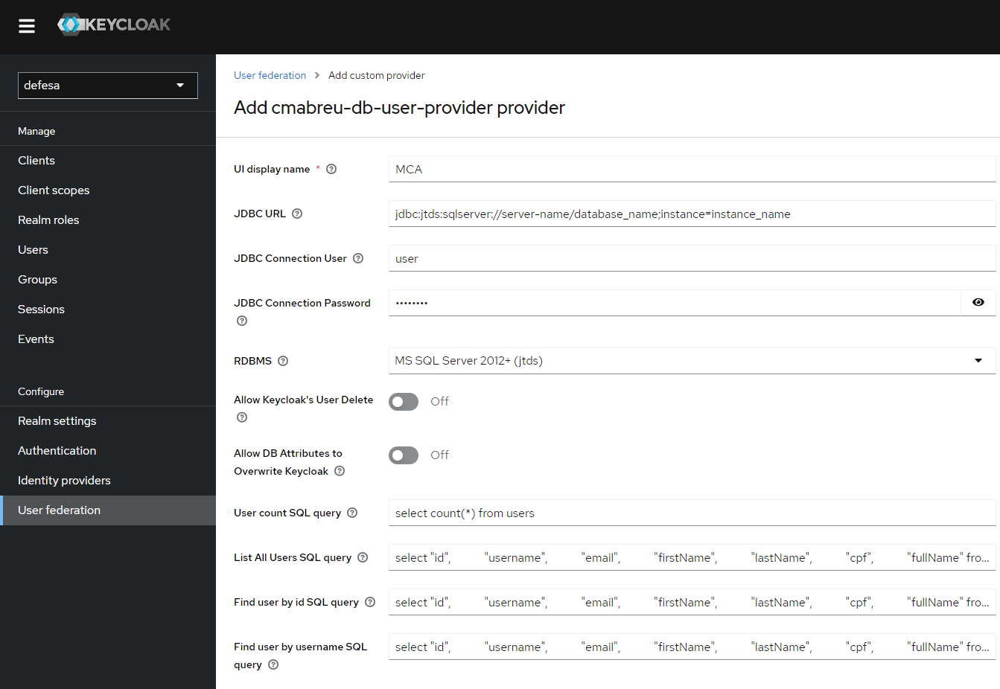

# cmabreu-keycloak-database-federation

### Compatible with Keycloak 21.1.2 quarkus based.

Based on ChemaDeveloper's singular-keycloak-database-federation

https://github.com/ChemaDeveloper/singular-keycloak-database-federation

wich is a fork from opensingular singular-keycloak-database-federation

https://github.com/opensingular/singular-keycloak-database-federation

## Help Wanted

Your help is welcome if you want to keep this repository up to date.

## This is not a fork. What I've done here:

 - Updated to use Keycloak 21.1.2 version
 - Use the legacy Database Support libs. I don't know how to use the new ones.
 - Changed the log engine (removed the JBossLog annotation)
 - 
## What is this?

Keycloak User Storage SPI for Relational Databases (Keycloak User Federation, supports postgresql, mysql, oracle and mysql).

- Keycloak User federation provider with SQL
- Keycloak User federation using existing database
- Keycloak  database user provider
- Keycloak MSSQL Database Integration 
- Keycloak SQL Server Database Integration 
- Keycloak Oracle Database Integration 
- Keycloak Postgres Database Integration 
- Keycloak blowfish bcrypt support

## Attention!

    Keycloak was changed the way to implement DBUserStorageProvider. If you know how to do it now, please tell us.

## Configuration

Keycloak User Federation Screen Shot

There is a new configuration that allows keycloak to remove a user entry from its local database (this option has no effect on the source database). It can be useful when you need to reload user data.
This option can be configured by the following switch:

## Limitations

    - Do not allow user information update, including password update
    - Do not supports user roles our groups

## Custom attributes

Just add a mapper to client mappers with the same name as the returned column alias in your queries.Use mapper type "User Attribute". See the example below:
    

## Build

    - mvn clean package

## Deployment

    1) Copy every  `.jar` from dist/ folder  to  /providers folder under your keycloak installation root. 
        - i.e, on a default keycloak setup, copy all  `.jar` files to <keycloak_root_dir>/providers
    2) run :
        $ ./bin/kc.sh start-dev
    OR if you are using a production configuration:
        $ ./bin/kc.sh build
        $ ./bin/kc.sh start

## Issues:
    Open a ticket as usual. I'll do my best to answer.
    
    

